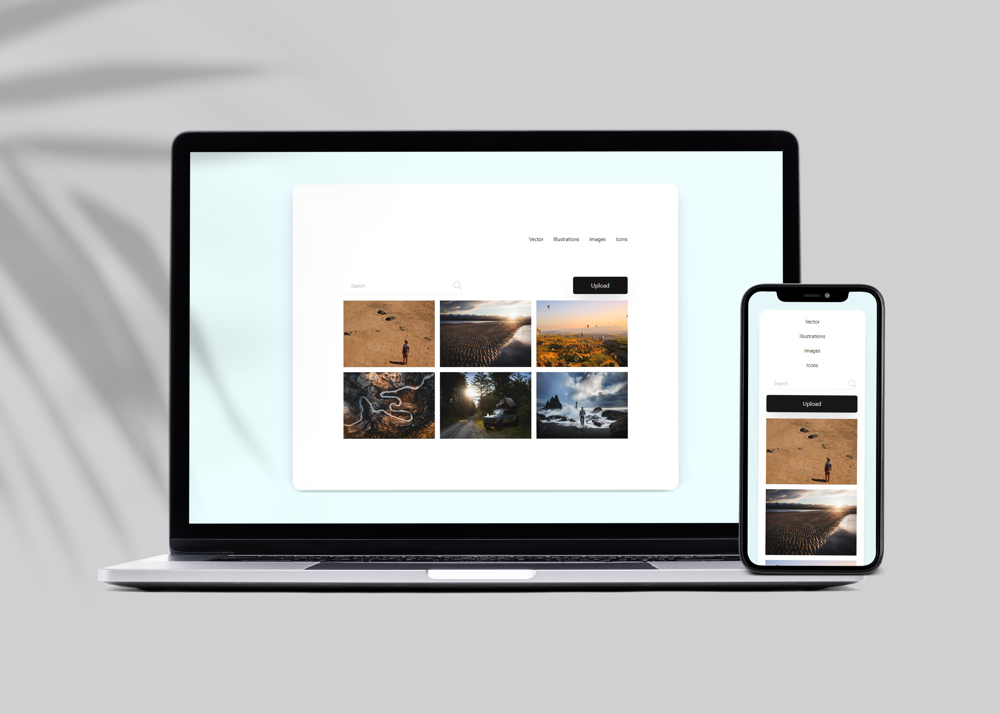

# Image gallery



Image gallery built with HTML and styling with Tailwind CSS.

Represents the navigation at the top, nice hover effect for button and nav items, clean looking searche bar with an SVG and images gallery with text hover effect. 

Fully responsive because of Grid and Flexbox.

## ⚡ Setup

Install Tailwind CSS with CDN - Add the Play CDN script tag to the <head> of your HTML file, and start using Tailwind’s utility classes to style your content.

```
<!doctype html>
<html>
<head>
  <meta charset="UTF-8">
  <meta name="viewport" content="width=device-width, initial-scale=1.0">
  <script src="https://cdn.tailwindcss.com"></script>
</head>
<body>
  <h1 class="text-3xl font-bold underline">
    Hello world!
  </h1>
</body>
</html>
```

## ⚡ Built With
[HTML5](https://www.w3schools.com/html/) / [Tailwind CSS](https://tailwindcss.com/) 